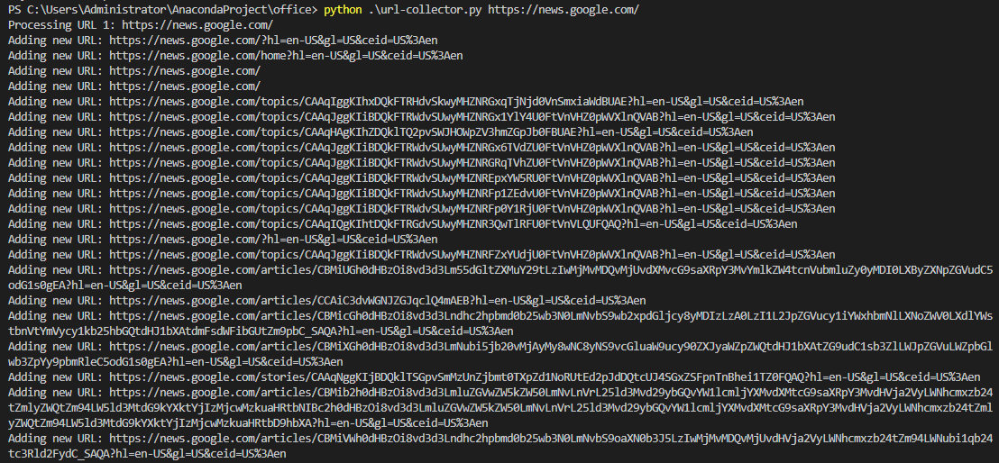

# Overview

`url-collector` is a Python program that collects all the URLs of HTML pages under a specific domain and saves them in an SQLite database. This can be useful for various purposes such as web scraping, analysis, or archiving.




# Installation

To install the `url-collector` program, follow these steps:
1. Clone the repository to your local machine or download the source code as a ZIP file and extract it.
2. Navigate to the directory containing the program files.
3. Install the required dependencies by running the following command:

```bash

pip install -r requirements.txt
```


# Usage

To use `url-collector`, run the following command:

```bash

python url-collector.py <initial_url>
```


Replace `<initial_url>` with the URL of the domain you want to start the URL collection from.
# Precautions

Please note that this program is intended for educational purposes and should not be used to scrape websites without the website owner's permission. Be sure to respect the target website's terms of service, robots.txt, and applicable laws.
# License

This program is released under the MIT License.

---

# 概要

`url-collector`は、特定のドメイン配下のすべてのHTMLページのURLを収集し、SQLiteデータベースに保存するPythonプログラムです。これは、ウェブスクレイピング、分析、アーカイブなど、さまざまな目的に役立ちます。
# インストール方法

`url-collector`プログラムをインストールするには、以下の手順を実行してください。
1. リポジトリをローカルマシンにクローンするか、ソースコードをZIPファイルとしてダウンロードして解凍します。
2. プログラムファイルが含まれるディレクトリに移動します。
3. 以下のコマンドを実行して、必要な依存関係をインストールします。

```bash

pip install -r requirements.txt
```


# 使い方

`url-collector`を使用するには、次のコマンドを実行します。

```bash

python url-collector.py <initial_url>
```


`<initial_url>`を、URL収集を開始するドメインのURLに置き換えてください。
# 注意事項

このプログラムは教育目的で提供されており、ウェブサイトの所有者の許可なくウェブサイトをスクレイピングする目的で使用すべきではありません。対象ウェブサイトの利用規約、robots.txt、および適用される法律を尊重してください。
# ライセンス

このプログラムはMITライセンスの下でリリースされています。
